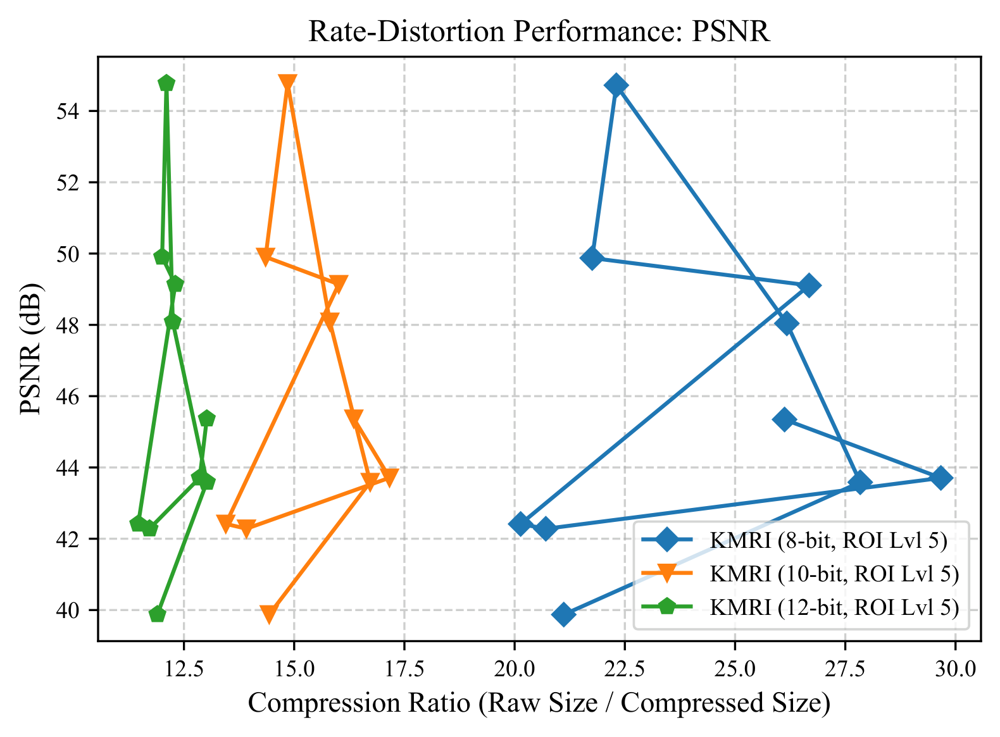
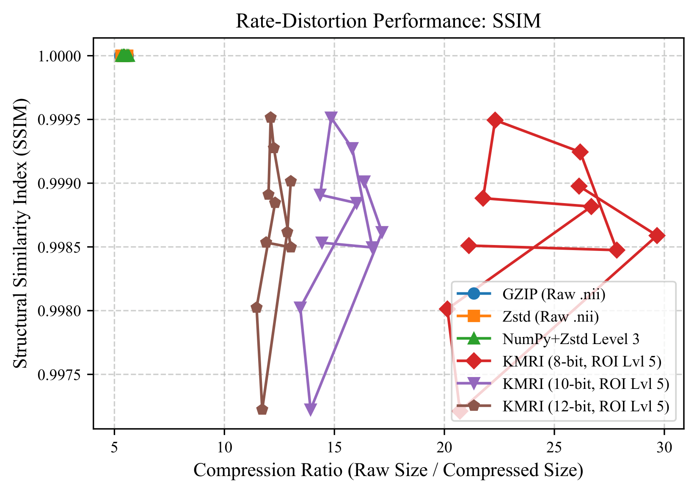
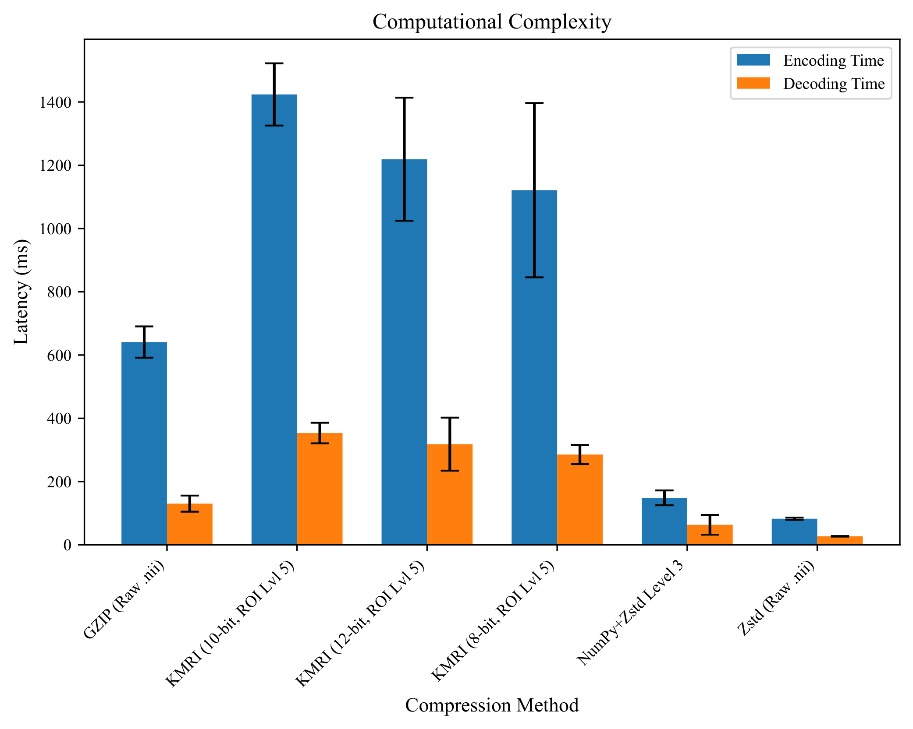
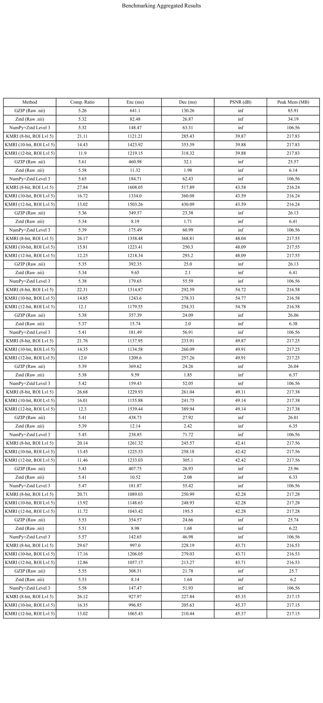

# KMRI

> Experimental medical imaging compression framework exploring chunked, structure-aware alternatives to `.nii.gz` (gzip-based NIfTI compression)

KMRI is a high-performance medical imaging compression system for volumetric MRI/NIfTI data built with **Python + C++ (pybind11 + Zstd)**.

It explores whether **structure-aware compression** can outperform traditional generic compression methods like gzip.

---

# ⚡ TL;DR

Structure-aware compression framework for volumetric medical imaging that has:

- splits MRI volumes into chunks
- applies ROI-aware compression strategies
- uses Zstandard instead of gzip
- optionally quantizes intensity data
- preserves segmentation masks losslessly
- improves compression vs speed trade-offs

---

# 🧠 Why this project exists

Most medical imaging pipelines still rely on:

> `.nii.gz` = raw gzip compression of entire volume

This is simple — but inefficient.

KMRI explores a different idea:

> What if compression understood the structure of the data?

Instead of treating MRI scans as flat byte streams, KMRI uses:
- spatial awareness
- region importance (ROI)
- sparsity detection
- adaptive compression levels

---

# 📊 What KMRI tries to improve

Compared to `.nii.gz` (gzip):

- better compression ratios on structured data
- faster decode performance via chunked access
- more control over quality vs size
- smarter handling of empty/sparse regions

---

# 🚀 Features

- ⚙ C++ compression core using Zstd (via pybind11)
- 🧩 Chunk-based 3D volume encoding
- 🎯 ROI-aware adaptive compression
- 🧠 Automatic mask vs intensity detection
- 🔢 Optional N-bit quantization (8–16 bit)
- 📦 Sparse chunk skipping (zero-block optimization)
- 🧬 Custom `.kmri` container format
- 📊 Full benchmark suite:
  - compression ratio analysis
  - latency profiling
  - PSNR / SSIM evaluation
  - comparison against gzip & zstd baselines

---

# 📈 Benchmarks

KMRI is evaluated against:

- `.nii.gz` (gzip baseline)
- raw Zstandard compression
- NumPy + Zstd pipelines

Metrics:

- compression ratio
- encode time
- decode time
- memory usage
- PSNR
- SSIM

---

## 📉 Benchmark Results

### PSNR (reconstruction quality)

<p align="center">
  
</p>

---

### SSIM (structural similarity)

<p align="center">
  
</p>

---

### Latency comparison

<p align="center">
  
</p>

---

### Baseline comparison

<p align="center">
  
</p>

---

# ⚙ How it works

## Encoding pipeline

1. Load NIfTI volume
2. Detect type:
   - segmentation mask
   - intensity scan
3. Split into 3D chunks
4. Apply:
   - quantization (optional)
   - ROI-aware compression strategy
   - sparse chunk skipping
5. Compress chunks using Zstd (C++ core)
6. Write `.kmri` file with metadata + chunk table

---

## Decoding pipeline

1. Read `.kmri` header
2. Load chunk index table
3. Decompress chunk data
4. Reconstruct full 3D volume
5. Apply dequantization (if needed)
6. Export NIfTI output

---

# 🔧 Compression design

## Quantization

Intensity volumes can be reduced to:

- 8-bit
- 10-bit
- 12-bit
- up to 16-bit

This reduces storage while maintaining useful reconstruction quality.

Segmentation masks remain fully lossless.

---

## 🎯 ROI-aware compression

Not all regions are equal:

- ROI (important tissue regions): higher fidelity
- background: higher compression

This improves efficiency without sacrificing key information.

---

## 📦 Sparse optimization

Completely empty chunks are not stored as full payloads.

Instead, they are represented using metadata flags, reducing storage for sparse scans.

---

# 🧪 Benchmarking

Run benchmarks:

```python KMRI/benchmarks/benchmark/run_benchmark.py --input path/to/nifti_dataset```

Outputs:

**JSON results**

**CSV summaries**

**latency analysis**

**PSNR / SSIM plots**

**baseline comparison charts**

# 🏗 Project structure

KMRI/
│
├── kmri_encode.py
├── kmri_decode.py
├── kmri_core.cpp
│
├── benchmarks/
│   └── benchmark/
│       └── run_benchmark.py
│
└── ...
# 💡 Example usage

## Encode
```
import kmri_encode

kmri_encode.encode_kmri_cpp(
    "brain_scan.nii",
    "brain_scan.kmri",
    bits=10
)
```
## Decode
```
import kmri_decode

kmri_decode.decode_kmri_cpp(
    "brain_scan.kmri",
    "reconstructed_scan.nii"
)
```
# 🧰 Tech stack

**Python**

**NumPy**

**NiBabel**

**Pandas**

**Matplotlib**

**Pybind11**

**C++**

**Zstandard (Zstd)**

**pybind11 bindings**

# 📦 KMRI file format

Each .kmri file contains:

**magic bytes + version**

**JSON metadata header**

**chunk lookup table**

**compressed chunk payloads**

# Designed for:

**fast decoding**

**low overhead**

**scalable volumetric storage**

# 🧭 Status

**KMRI is experimental and actively evolving.**

Current research directions:

GPU acceleration

streaming decode

improved ROI detection

entropy modeling

parallel compression

learned compression approaches

# 🎯 Vision

KMRI explores a simple idea:

**Compression should understand structure, not just bytes.**

Not just smaller files.

**Smarter files.**

# 📄 License

BSD 3-Clause

# 👤 Author

Built by Kiamehr

Contact: kiamehr13922014@gmail.com
